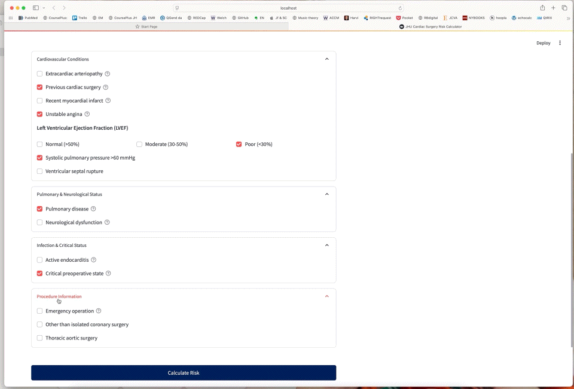

# JHU Cardiac Surgery Risk Calculator

## Overview

The JHU Cardiac Surgery Risk Calculator is an interactive web application built with Streamlit that provides evidence-based estimations of post-operative mortality risk for patients undergoing cardiac surgery. The tool is designed to assist healthcare professionals in preoperative risk assessment and clinical decision-making.

## Features

- **Comprehensive Risk Assessment**: Incorporates multiple validated risk factors based on a modified version of the European System for Cardiac Operative Risk Evaluation (EuroSCORE) methodology.
- **Interactive Interface**: User-friendly design with expandable sections for different risk categories.
- **Visual Risk Representation**: Displays calculated risk with intuitive gauge charts and color-coded risk levels.
- **Risk Factor Analysis**: Shows the contribution of each factor to the overall risk score.
- **Educational Resources**: Includes detailed glossary and context for clinical interpretation.

## Risk Factors Assessed

The calculator evaluates numerous patient characteristics and clinical conditions, including:

- Demographic factors (age, gender)
- Renal function
- Cardiovascular conditions (arteriopathy, previous surgery, LVEF, etc.)
- Pulmonary and neurological status
- Infection and critical preoperative state
- Procedure type and urgency

## Clinical Application

This tool is intended to:
- Facilitate informed consent discussions with patients
- Support risk stratification and clinical decision-making
- Enable quality improvement initiatives and benchmarking
- Enhance preoperative planning and resource allocation

## Technical Implementation

The application is built using:
- **Streamlit**: For the interactive web interface
- **Pandas & NumPy**: For data handling and calculations
- **Matplotlib & Seaborn**: For visualization of risk assessment

## Limitations

While providing valuable risk estimates, this tool:
- Should complement, not replace, clinical judgment
- May not capture all possible risk factors or unique patient circumstances
- Is based on historical data that may not reflect the most recent advances

